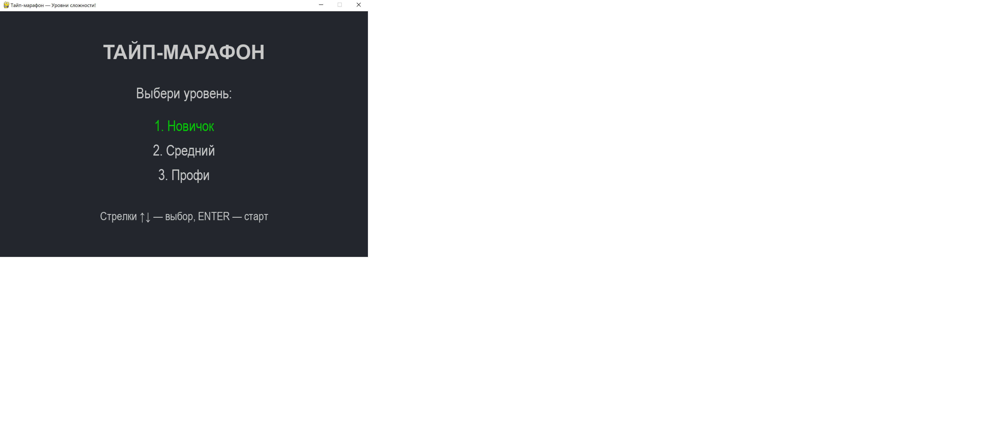
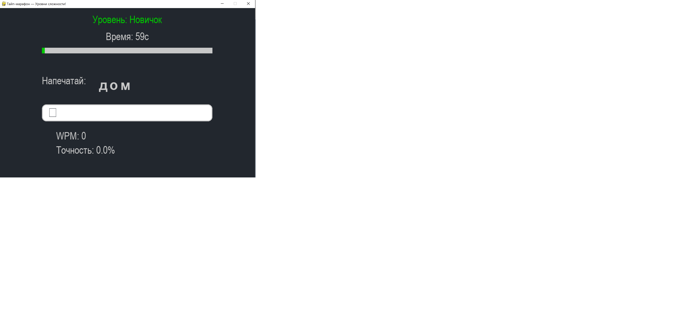
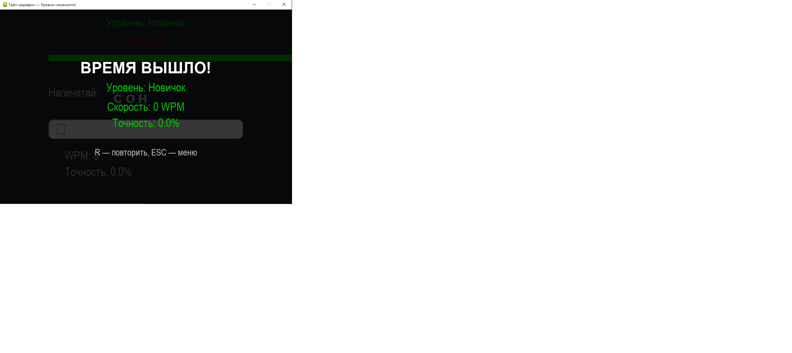

 Отчет: Разработка игры «Тайп-марафон» на Python (Pygame)

 1. Исследование предметной области

 1.1 Что это за технология

Проект представляет собой обучающую игру для тренировки скорости печати. Он реализован с использованием библиотеки **Pygame**, которая позволяет создавать 2D-приложения и игры на Python.

 1.2 Основные задачи

* Обработка ввода пользователя
* Работа с таймером
* Отрисовка интерфейса
* Подсчет статистики (WPM, точность)
* Управление состояниями игры

 1.3 Анализ аналогов

Аналоги:

* Keybr
* Monkeytype

Общие функции:

* Ввод текста
* Таймер
* Статистика

 2. Последовательность разработки технологии

 Шаг 1: Выбор инструментов

* Язык: Python
* Библиотека: Pygame

 Шаг 2: Проектирование

Определяем:

* Экран
* Игровые состояния
* Логику уровней

 Шаг 3: Реализация базовой структуры

Создаем окно и главный цикл

 Шаг 4: Добавление логики

* Генерация слов
* Обработка ввода
* Подсчет статистики

 Шаг 5: Интерфейс

* Меню
* Игровой экран
* Экран завершения

 Шаг 6: Тестирование

Проверка:

* Ввода
* Таймера
* Подсчетов

 3. Техническое руководство (для начинающих)

 3.1 Установка

bash
pip install pygame

 3.2 Создание окна

import pygame
pygame.init()

WIDTH, HEIGHT = 900, 600
WIN = pygame.display.set_mode((WIDTH, HEIGHT))
pygame.display.set_caption("Тайп-марафон")

 3.3 Главный игровой цикл

running = True
while running:
    for event in pygame.event.get():
        if event.type == pygame.QUIT:
            running = False

 3.4 Работа с текстом

font = pygame.font.SysFont('arial', 36)
text = font.render("Пример", True, (255,255,255))
WIN.blit(text, (100,100))

 3.5 Обработка ввода

if event.type == pygame.KEYDOWN:
    if event.key == pygame.K_BACKSPACE:
        input_text = input_text[:-1]
    else:
        input_text += event.unicode

 3.6 Таймер

import time
start_time = time.time()
elapsed = time.time() - start_time

 3.7 Подсчет скорости (WPM)

def get_wpm(correct_chars, start_time):
    elapsed = max(time.time() - start_time, 1)
    words = correct_chars / 5
    return round(words * 60 / elapsed)

 3.8 Подсчет точности

def get_accuracy(correct, total):
    return (correct / total * 100) if total > 0 else 0

 3.9 Система уровней

LEVELS = {
    1: {"name": "Новичок", "time": 60},
    2: {"name": "Средний", "time": 60},
    3: {"name": "Профи", "time": 45}
}

 3.10 Управление состояниями

game_state = "menu"   menu, playing, game_over

 4. Разбор ключевых частей проекта

 4.1 Функция reset_game

Сбрасывает параметры игры

def reset_game():
    global current_word, input_text
    current_word = random.choice(level_data["words"])
    input_text = ""

 4.2 Отрисовка интерфейса

Пример:

pygame.draw.rect(WIN, (255,255,255), (100,100,200,50))

 4.3 Подсветка текста

if input_text[i] == current_word[i]:
    color = GREEN
else:
    color = RED

 4.4 Логика завершения игры

if time.time() - start_time >= level_data["time"]:
    game_state = "game_over"

 5. Полный пример запуска

if __name__ == "__main__":
    main()

 6. Рекомендации по улучшению

* Добавить звук
* Добавить сохранение результатов
* Сделать онлайн-таблицу лидеров
* Добавить новые режимы

 7. Итог

В ходе разработки:

✔ Изучена библиотека Pygame
✔ Реализован игровой цикл
✔ Создана система уровней
✔ Добавлена статистика

Проект можно расширять и использовать как основу для более сложных игр.

Конец отчета
